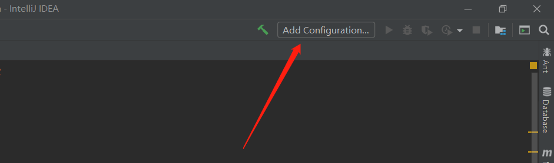
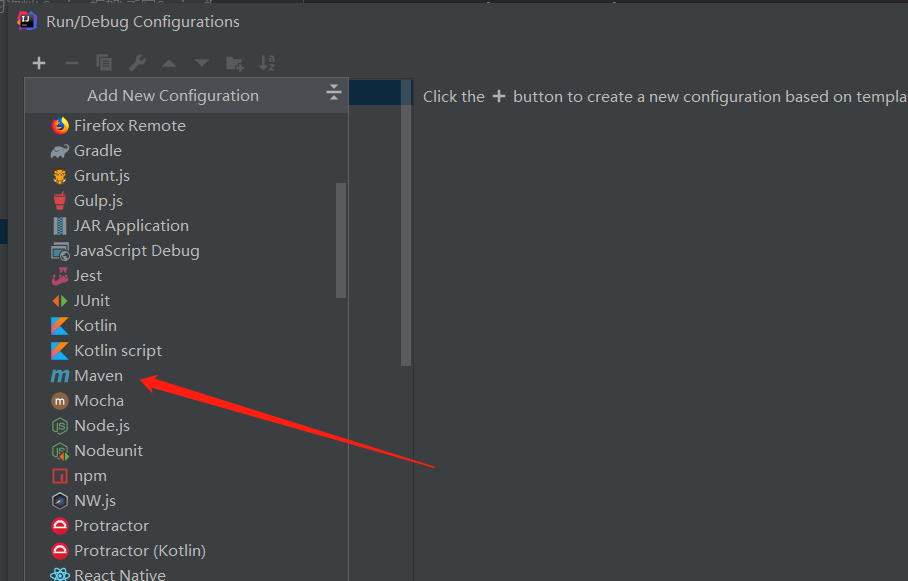
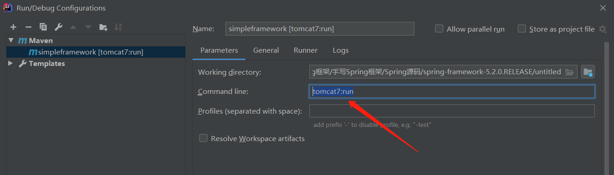
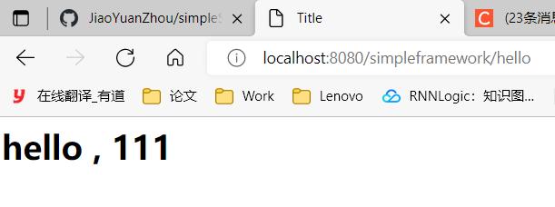
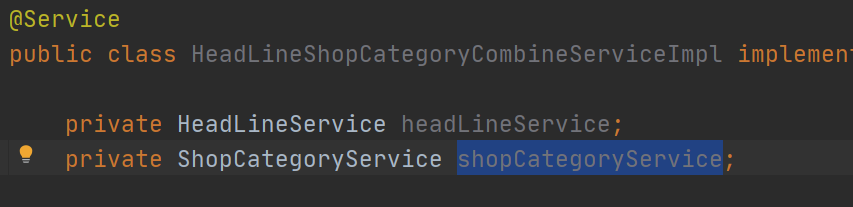

# simpleSpringFramework
带你实现一个简单的Spring框架（需要有一定的Spring基础），自研框架由IOC,AOP,MVC三部分组成


## 1、环境搭建

1. 用IDEA创建一个maven项目
2. 导入依赖，将pom.xml中的内容复制到自己的项目中
3. 将github项目中java文件夹下的com文件夹和webapp文件夹复制到自己的项目中
4. 点击Add configuration按钮
5. 
6. 输入tomcat7:run
7. 点击运行，（会提示程序包org.simpleframework.core.annotation不存在错误）此时将@Service、@Controller和对应的import注释掉即可
8. 出现以下图像即为成功
9. 以上部分是自研框架的雏形


## 2、自研框架IOC容器的实现

**需要的前置知识**

- 单例模式（饿汉、懒汉、枚举类实现的三种设计模型）
- 反射、注解等基础知识
- JVM中的类加载


**框架具备的基础功能**

- 解析配置
- 定位和注册对象
- 注入对象
- 提供通用的工具类


**实现IOC容器主要需要实现下面的点**

1. 创建注解
2. 提取标记对象
3. 实现容器
4. 依赖注入


### 2.1、创建注解

创建包org.simpleframework.core.annotation，当中再创建四个注解@Controller、@Service、@Component、@Reposity

```java
@Target(ElementType.TYPE)
@Retention(RetentionPolicy.RUNTIME)
public @interface Component {
}

@Target(ElementType.TYPE)
@Retention(RetentionPolicy.RUNTIME)
public @interface Controller {
}

@Target(ElementType.TYPE)
@Retention(RetentionPolicy.RUNTIME)
public @interface Repository {
}

@Target(ElementType.TYPE)
@Retention(RetentionPolicy.RUNTIME)
public @interface Service {
}
```


### 2.2、提取标记对象

**实现思路**

- 指定范围，获取范围内的所有类
- 遍历所有类，获取被注解标记的类并加载进容器中


#### 2.2.1、指定范围，获取范围内的所有类

创建ClassUtil类，此类放在org.simpleframework.util包下，主要保存跟类相关的通用方法。

首先实现通过用户传入的包名（例如获取entity包下所有的类）来获取这个包下所有的类

定义方法extractPackageClass来实现

1. 获得类加载器
2. 通过classLoader.getResource()来获得包所在的URL路径
3. 依据不同的资源类型，采用不同的方式获取资源的集合，过滤掉协议不是FTP的URL
   1. extratClassFile方法作用是提取包文件夹下的.class文件（需要了解JVM类加载相关知识）并生成class对象放入classSet中

```java
	public static final String FILE_PROTOCOL = "file";   
	/**
     * 获取包下类集合
     * @param packageName 包名
     * @return 类集合
     */
   public static Set<Class<?>> extractPackageClass(String packageName) {

       //1、获取到类的加载器
       ClassLoader classLoader = getClassLoader();

       //2、通过类加载器获取到加载的资源
       URL url = classLoader.getResource(packageName.replace(".","/"));
       if (url == null) {
           log.warn("unable to retrieve anything from package" + packageName);
           return null;
       }

       //3、依据不同的资源类型，采用不同的方式获取资源的集合
       Set<Class<?>> classSet = null;
       //过滤出文件类型的资源
       if (url.getProtocol().equalsIgnoreCase(FILE_PROTOCOL)) {
           classSet = new HashSet<Class<?>>();
           File packageDirectory = new File(url.getPath());
           extratClassFile(classSet, packageDirectory, packageName);
       }
       return classSet;
   }
```


**extratClassFile方法讲解**

1. 采用递归的方式来获取所有的class文件
2. 如果传进来的fileSource不是一个文件夹，就返回
3. 调用其listFiles方法获取文件夹下的文件或者文件夹
4. 如果是class文件就使用addToClassSet方法进行加载（通过类的全限定名进行加载）

```java
/**
     * 递归获取目标package里面的所有class文件（包括子package里的class文件）
     * @param emptyClassSet
     * @param fileSource
     * @param packageName
     */
    private static void extratClassFile(Set<Class<?>> emptyClassSet, File fileSource, String packageName) {
        //如果不是一个文件夹就返回
        if (!fileSource.isDirectory()) {
            return;
        }
        //如果是一个文件夹，则调用其listFiles方法获取文件夹下的文件或者文件夹
        File[] files = fileSource.listFiles(new FileFilter() {
            @Override
            public boolean accept(File file) {
                if (file.isDirectory()) {
                    return true;
                }else {
                    //获取文件的绝对值路径
                    String absoluteFilePath = file.getAbsolutePath();
                    if (absoluteFilePath.endsWith(".class")) {
                        //若是class文件，则直接加载
                        addToClassSet(absoluteFilePath);
                    }
                }
                return false;
            }

            //根据class文件的绝对值路径，获取并生成class对象，并放入classSet中
            private void addToClassSet(String absoluteFilePath) {
                //1、从class文件的绝对值路径中提取出包含package的类名
                absoluteFilePath = absoluteFilePath.replace(File.separator,".");
                String className = absoluteFilePath.substring(absoluteFilePath.indexOf(packageName));
                className = className.substring(0,className.lastIndexOf("."));

                //2、通过反射机制获取对应的Class对象并放入classSet中
                Class<?> targetClass = loadClass(className);
                emptyClassSet.add(targetClass);
            }
        });
        if (files != null) {
            for(File f : files) {
                extratClassFile(emptyClassSet, f, packageName);
            }
        }
   }
```


可以使用junit来进行测试自己写的对不对，创建测试类

```java
public class ClassUtilTest {

    @DisplayName("提取目标类方法：extractPackageClassTest")
    @Test
    public void extractPackageClassTest() {
        Set<Class<?>> classSet = ClassUtil.extractPackageClass("com.imooc.entity");
        System.out.println(classSet);
        Assertions.assertEquals(4,classSet.size());
    }
}
```


#### 2.2.2、遍历classSet中存的所有类，获取被注解标记的类并加载进容器中

**首先我们得创建一个容器类BeanContainer**（枚举类单例模式实现）

- 容器中的对象用键值对的形式存储**<类的class对象，类的实例化对象>**，使用ConcurrentHashMap来存储保证线程安全
- loadBeans为加载被标注类的方法
  - 扫描类上定义的注解
  - 如果与BEAN_ANNOTATION定义的四个注解相同就加入容器中

```java
@Slf4j
@NoArgsConstructor(access = AccessLevel.PRIVATE)
public class BeanContainer {

    /**
     * 存放所有被配置标记的目标对象的Map
     */
    private final Map<Class<?>, Object> beanMap = new ConcurrentHashMap<>();

    /**
     * 加载bean的注解列表
     */
    private static final List<Class<? extends Annotation>> BEAN_ANNOTATION
            = Arrays.asList(Component.class, Controller.class, Service.class, Repository.class);

    /**
     * 获取Bean容器实例
     * @return
     */
    public static BeanContainer getInstance() {
        return ContainerHolder.HOLDER.instance;
    }

    private enum ContainerHolder{
        HOLDER;
        private BeanContainer instance;
        ContainerHolder() {
            instance = new BeanContainer();
        }
    }

    /**
     * 容器是否已经加载过bean
     */
    private boolean loaded = false;

    public boolean isLoaded() {
        return loaded;
    }


    /**
     * 返回Bean实例对象
     * @return
     */
    public int size() {
        return beanMap.size();
    }


    /**
     * 加载被注解标记的类并加入容器中
     * @param packageName
     */
    public synchronized void loadBeans(String packageName) {
        //判断bean容器是否被加载过
        if (isLoaded()) {
            log.warn("BeanContainer has been loaded");
            return ;
        }

        Set<Class<?> > classSet = ClassUtil.extractPackageClass(packageName);
        if (ValidationUtil.isEmpty(classSet)) {
            log.warn("extract nothing from packageName" + packageName);
            return;
        }
        for (Class<?> clazz : classSet) {
            for (Class<? extends Annotation> annotation : BEAN_ANNOTATION) {
                //如果类上面标记了定义的注解
                if (clazz.isAnnotationPresent(annotation)) {
                    //将目标类本身作为键，目标类的实例作为值，放入到beanMap中
                    beanMap.put(clazz, ClassUtil.newInstance(clazz,true));

                }
            }
        }
        loaded = true;
    }
}

```


### 2.3、实现容器

**实现容器的操作方式**

- 增加、删除操作
- 根据Class获取对应实例
- 获取所有的Class和实例
- 通过注解来获取被注解标注的Class
- 通过超类获取对应子类Class
- 获取容器载体保存Class的数量

容器的方法都写在BeanContainer中

```java
package org.simpleframework.core;


import lombok.AccessLevel;
import lombok.NoArgsConstructor;
import lombok.extern.slf4j.Slf4j;
import org.simpleframework.core.annotation.Component;
import org.simpleframework.core.annotation.Controller;
import org.simpleframework.core.annotation.Repository;
import org.simpleframework.core.annotation.Service;
import org.simpleframework.util.ClassUtil;
import org.simpleframework.util.ValidationUtil;

import java.lang.annotation.Annotation;
import java.util.*;
import java.util.concurrent.ConcurrentHashMap;

@Slf4j
@NoArgsConstructor(access = AccessLevel.PRIVATE)
public class BeanContainer {

    /**
     * 存放所有被配置标记的目标对象的Map
     */
    private final Map<Class<?>, Object> beanMap = new ConcurrentHashMap<>();

    /**
     * 加载bean的注解列表
     */
    private static final List<Class<? extends Annotation>> BEAN_ANNOTATION
            = Arrays.asList(Component.class, Controller.class, Service.class, Repository.class);

    /**
     * 获取Bean容器实例
     * @return
     */
    public static BeanContainer getInstance() {
        return ContainerHolder.HOLDER.instance;
    }

    private enum ContainerHolder{
        HOLDER;
        private BeanContainer instance;
        ContainerHolder() {
            instance = new BeanContainer();
        }
    }

    /**
     * 容器是否已经加载过bean
     */
    private boolean loaded = false;

    public boolean isLoaded() {
        return loaded;
    }


    /**
     * 返回Bean实例对象
     * @return
     */
    public int size() {
        return beanMap.size();
    }


    /**
     * 加载被注解标记的类并加入容器中
     * @param packageName
     */
    public synchronized void loadBeans(String packageName) {
        //判断bean容器是否被加载过
        if (isLoaded()) {
            log.warn("BeanContainer has been loaded");
            return ;
        }

        Set<Class<?> > classSet = ClassUtil.extractPackageClass(packageName);
        if (ValidationUtil.isEmpty(classSet)) {
            log.warn("extract nothing from packageName" + packageName);
            return;
        }
        for (Class<?> clazz : classSet) {
            for (Class<? extends Annotation> annotation : BEAN_ANNOTATION) {
                //如果类上面标记了定义的注解
                if (clazz.isAnnotationPresent(annotation)) {
                    //将目标类本身作为键，目标类的实例作为值，放入到beanMap中
                    beanMap.put(clazz, ClassUtil.newInstance(clazz,true));

                }
            }
        }
        loaded = true;
    }

    /**
     * 新增Bean实例
     * @param clazz
     * @param bean
     * @return
     */
    public Object addBean(Class<?> clazz, Object bean) {
        return beanMap.put(clazz, bean);
    }

    /**
     * 移除Bean实例
     * @param clazz
     * @return
     */
    public Object removeBean(Class<?> clazz) {
        return beanMap.remove(clazz);
    }

    /**
     * 获取Bean实例
     * @param clazz
     * @return
     */
    public Object getBean(Class<?> clazz) {
        return beanMap.get(clazz);
    }

    /**
     * 获取容器中所有Class对象集合
     * @return
     */
    public Set<Class<?>> getClasses(){
        return beanMap.keySet();
    }

    /**
     * 获取所有Bean集合
     * @return
     */
    public Set<Object> getBeans() {
        return new HashSet<>(beanMap.values());
    }

    /**
     * 返回带有特定注解的class对象
     * @param annotation
     * @return
     */
    public Set<Class<?>> getClassByAnnotation(Class<? extends Annotation> annotation) {
        //1、获取beanMap的所有class对象
        Set<Class<?>> keySet = getClasses();
        if (ValidationUtil.isEmpty(keySet)) {
            log.warn("nothing in beanMap");
            return null;
        }
        //2、通过注解筛选被注解标记的class对象，并添加到classSet里
        Set<Class<?>> classSet = new HashSet<>();
        for (Class<?> clazz :keySet) {
            //类是否有相关的标记注解
            if (clazz.isAnnotationPresent(annotation)) {
                classSet.add(clazz);
            }
        }
        return classSet.size() > 0 ? classSet: null;
    }

    public Set<Class<?>> getClassesBySuper(Class<?> interfaceOrClass) {
        //1、获取beanMap的所有class对象
        Set<Class<?>> keySet = getClasses();
        if (ValidationUtil.isEmpty(keySet)) {
            log.warn("nothing in beanMap");
            return null;
        }
        //2、判断keySet里的元素是否是传入的接口或者类的子类，如果是就添加到classSet里
        Set<Class<?>> classSet = new HashSet<>();
        for (Class<?> clazz :keySet) {

            if (clazz.isAssignableFrom(clazz)) {
                classSet.add(clazz);
            }
        }
        return classSet.size() > 0 ? classSet: null;
    }

}

```


测试方法

```java
package org.simpleframework.core;

import com.imooc.controller.DispatcherServlet;
import com.imooc.controller.frontend.MainPageController;
import org.junit.jupiter.api.*;

@TestMethodOrder(MethodOrderer.OrderAnnotation.class)
public class BeanContainerTest {
    private static BeanContainer beanContainer;

    @BeforeAll
    static void init() {
        beanContainer = BeanContainer.getInstance();
    }

    @DisplayName("加载目标类及其实例BeanContainer :loadBeanTest")
    @Test
    @Order(1)
    public void loadBeanTest() {
        Assertions.assertEquals(false,beanContainer.isLoaded());
        beanContainer.loadBeans("com.imooc");
        Assertions.assertEquals(6,beanContainer.size());
        Assertions.assertEquals(true,beanContainer.isLoaded());
    }

    @DisplayName("根据类获取其实例：getBeanTest")
    @Test
    @Order(2)
    public void getBeanTest() {

        MainPageController controller = (MainPageController)beanContainer.getBean(MainPageController.class);
        Assertions.assertEquals(true,controller instanceof MainPageController);
        DispatcherServlet dispatcherServlet = (DispatcherServlet)beanContainer.getBean(DispatcherServlet.class);
        Assertions.assertEquals(null,dispatcherServlet);
    }
}

```


### 2.4、依赖注入

**每个被注解标记的类都被放入了容器中，但是存在一种情况**



**HeadLineShopCategoryCombineServiceImpl中的headLineService和shopCategoryService并没有被实例化，所以就需要实现依赖注入**

**实现思路**

- 定义相关的注解标签
- 实现创建被注解标记的成员变量实例，并将其注入到成员变量里
- 依赖注入的使用


创建inject包，以及inject下的annotation包，annotation包创建注解@Autowired

```java
package org.simpleframework.inject.annotation;

import java.lang.annotation.ElementType;
import java.lang.annotation.Retention;
import java.lang.annotation.RetentionPolicy;
import java.lang.annotation.Target;

/**
 * Autowired目前仅支持成员变量注入
 *
 */
@Target(ElementType.FIELD)
@Retention(RetentionPolicy.RUNTIME)
public @interface Autowired {
    String value() default "";
}

```

DependencyInjector作用为实现依赖注入

1. 遍历Bean容器中所有的Class对象
2. 遍历Class对象的所有成员变量
3. 找出被Autowired标记的成员变量
4. 获取这些成员变量的类型
5. 获取这些成员变量的类型在容器里对应的实例
6. 通过反射将对应的成员变量实例注入到成员变量所在类的实例里

```java
package org.simpleframework.inject;

import lombok.extern.slf4j.Slf4j;
import org.simpleframework.core.BeanContainer;
import org.simpleframework.inject.annotation.Autowired;
import org.simpleframework.util.ClassUtil;
import org.simpleframework.util.ValidationUtil;

import java.lang.reflect.Field;
import java.util.Set;

@Slf4j
public class DependencyInjector {
    /**
     * Bean容器
     */
    private BeanContainer beanContainer;
    public DependencyInjector(){
        beanContainer = BeanContainer.getInstance();
    }
    /**
     * 执行Ioc
     */
    public void doIoc(){
        if(ValidationUtil.isEmpty(beanContainer.getClasses())){
            log.warn("empty classset in BeanContainer");
            return;
        }
        //1.遍历Bean容器中所有的Class对象
        for(Class<?> clazz : beanContainer.getClasses()){
            //2.遍历Class对象的所有成员变量
            Field[] fields = clazz.getDeclaredFields();
            if (ValidationUtil.isEmpty(fields)){
                continue;
            }
            for(Field field : fields){
                //3.找出被Autowired标记的成员变量
                if(field.isAnnotationPresent(Autowired.class)){
                    Autowired autowired = field.getAnnotation(Autowired.class);
                    String autowiredValue = autowired.value();
                    //4.获取这些成员变量的类型
                    Class<?> fieldClass = field.getType();
                    //5.获取这些成员变量的类型在容器里对应的实例
                    Object fieldValue = getFieldInstance(fieldClass, autowiredValue);
                    if(fieldValue == null){
                        throw new RuntimeException("unable to inject relevant type，target fieldClass is:" + fieldClass.getName() + " autowiredValue is : " + autowiredValue);
                    } else {
                        //6.通过反射将对应的成员变量实例注入到成员变量所在类的实例里
                        Object targetBean =  beanContainer.getBean(clazz);
                        ClassUtil.setField(field, targetBean, fieldValue, true);
                    }
                }
            }
        }


    }
    /**
     * 根据Class在beanContainer里获取其实例或者实现类
     */
    private Object getFieldInstance(Class<?> fieldClass, String autowiredValue) {
        Object fieldValue = beanContainer.getBean(fieldClass);
        if (fieldValue != null){
            return fieldValue;
        } else {
            Class<?> implementedClass = getImplementedClass(fieldClass, autowiredValue);
            if(implementedClass != null){
                return beanContainer.getBean(implementedClass);
            } else {
                return null;
            }
        }
    }
    /**
     * 获取接口的实现类
     */
    private Class<?> getImplementedClass(Class<?> fieldClass, String autowiredValue) {
        Set<Class<?>> classSet =  beanContainer.getClassesBySuper(fieldClass);
        if(!ValidationUtil.isEmpty(classSet)){
            if(ValidationUtil.isEmpty(autowiredValue)){
                if(classSet.size() == 1){
                    return classSet.iterator().next();
                } else {
                    //如果多于两个实现类且用户未指定其中一个实现类，则抛出异常
                    throw new RuntimeException("multiple implemented classes for " + fieldClass.getName() + " please set @Autowired's value to pick one");
                }
            } else {
                for(Class<?> clazz : classSet){
                    if(autowiredValue.equals(clazz.getSimpleName())){
                        return clazz;
                    }
                }
            }
        }
        return null;
    }
}

```

在ClassUtil中新增setField方法

```java
    /**
     * 设置类的属性值
     *
     * @param field      成员变量
     * @param target     类实例
     * @param value      成员变量的值
     * @param accessible 是否允许设置私有属性
     */
    public static void setField(Field field, Object target, Object value, boolean accessible){
        field.setAccessible(accessible);
        try {
            field.set(target, value);
        } catch (IllegalAccessException e) {
            log.error("setField error", e);
            throw new RuntimeException(e);
        }
    }
```


**一个简单的IOC容器就这样实现啦 : )**
